### What is an Artificial Neurone?

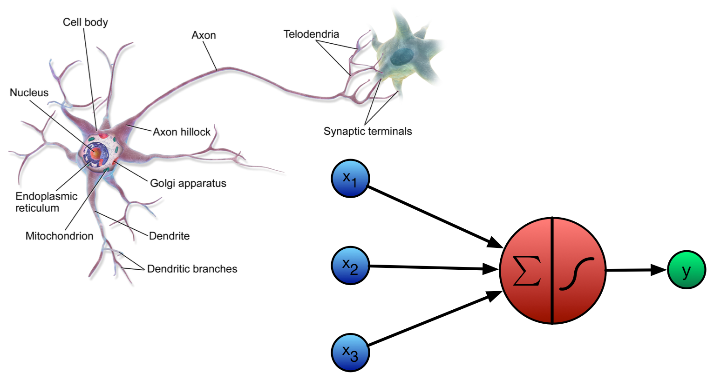{ width=100% }

[Source - Wikimedia Commons](https://en.wikipedia.org/wiki/File:Blausen_0657_MultipolarNeuron.png)

---

## Feed-Forward Network

{ width=75% }

For each unit: $y = \text{tanh}\big(Wx + b \big)$

---

## Recurrent Network

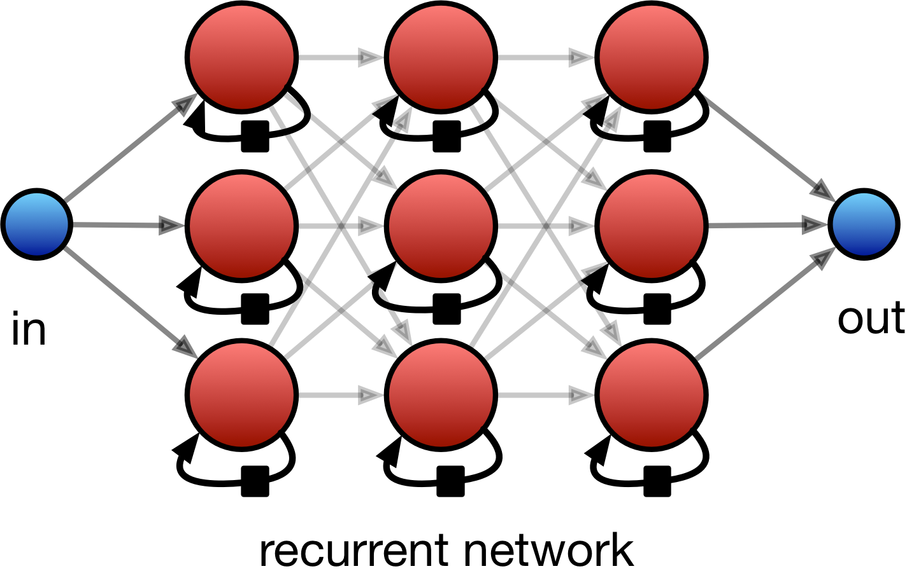{ width=75% }

For each unit: $y_t = \text{tanh}\big(Ux_t + Vh_{t-1} + b \big)$

---

## Sequence Learning Tasks

::: columns

:::: column
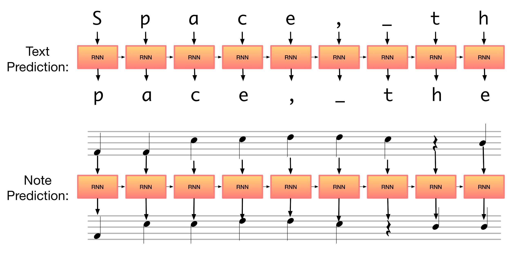

::::

::::column
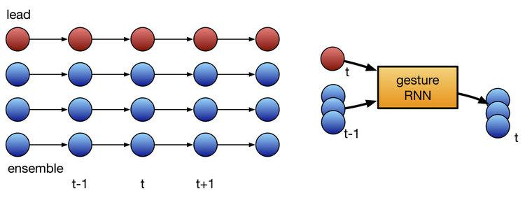
::::

:::

---

## Recurrent Network

{ width=75% }

simplifying...

---

## Recurrent Network

{ width=25% }

simplifying and rotating...

---

## "State" in Recurrent Networks

::: columns

:::: column
{ width=50% }
::::

:::: column
- Recurrent Networks are all about storing a “state” in between computations.
- A "lossy summary of... past sequences"
- _h_ is the "hidden state" of our RNN
- What influences _h_?
::::

:::

---

### Defining the RNN State

::: columns

:::: column
{ width=50% }
::::

:::: column
We can define a simplified RNN represented by this diagram as follows:

$$h_t = \text{tanh}\big(Ux_t + Vh_{t-1} + b \big)$$

$$\hat{y}_t = \text{softmax}(c + Wh_t)$$
::::

:::

---

## Unfolding an RNN in Time

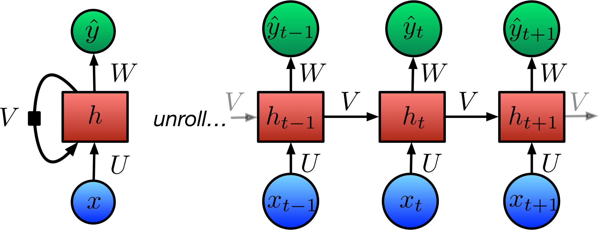

- By unfolding the RNN we can compute $\hat{y}$ for a given length of sequence.
- Note that the weight matrices $U$, $V$, $W$ are the same for each timestep; this is the big advantage of RNNs!

---

## Forward Propagation

::: columns

:::: column
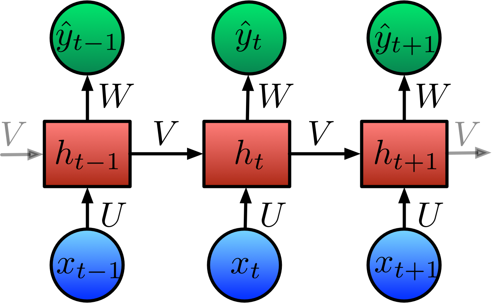
::::

:::: column
We can now use the following equations to compute $\hat{y}_3$, by computing $h$ for the previous steps:

$$h_t = \text{tanh}\big(Ux_t + Vh_{t-1} + b \big)$$

$$\hat{y}_t = \text{softmax}(c + Wh_t)$$
::::

:::

---

## Y-hat is Softmax'd

{ width=75% }

$\hat{y}$ is a probability distribution! A finite number of weights that add to 1: 

$$\sigma(\mathbf{z})_j = \frac{e^{z_j}}{\sum_{k=1}^K e^{z_k}} \text{ for } j = 1,\ldots, K$$

---

## Calculating Loss: Categorical Cross Entropy

::: columns

:::: column
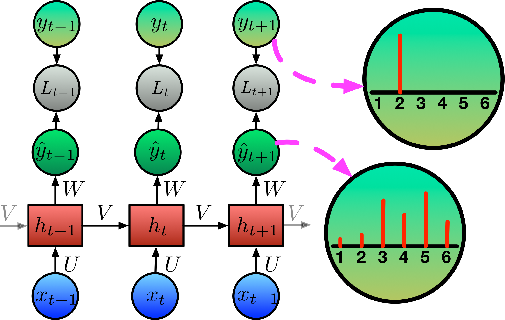
::::

:::: column
We use the categorical cross-entropy function for loss:	

\begin{align*}
h_t &= \text{tanh}\big( {b} + {Vh}_{t-1} + {Ux}_t \big) \\
\hat{y}_t &= \text{softmax}(c + Wh_t) \\
L_t &= -y_t \cdot \text{log}(\hat{y}_t) \\
\text{Loss} &= \sum_t L_t \\
\end{align*}
::::

:::

---

## Backpropagation Through Time (BPTT)

::: columns

:::: column
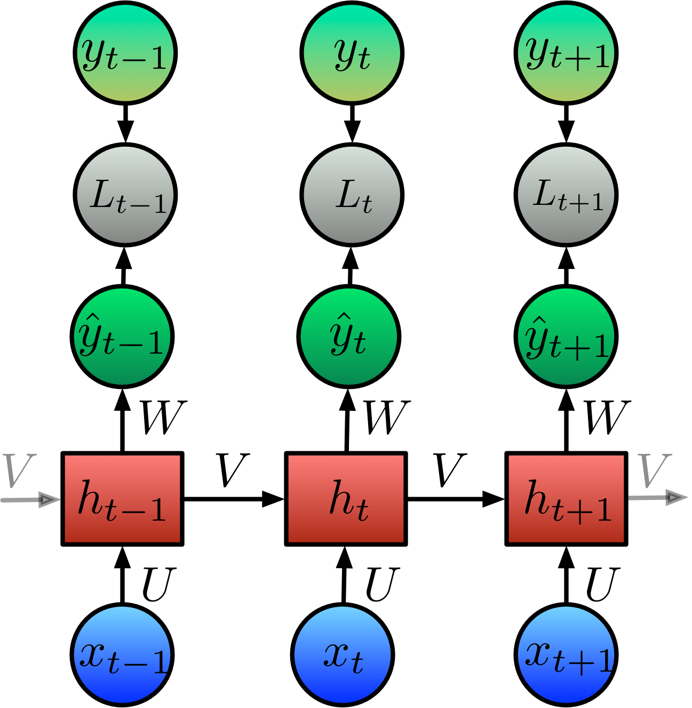
::::

:::: column
Propagates error correction backwards through the network graph, adjusting all parameters (_U_, _V_, _W_) to minimise loss.
::::

:::

---

## Example: Character-level text model

- **Training data:** a collection of text.
- **Input (_X_):** snippets of 30 characters from the collection.
- **Target output (_y_)**: 1 character, the next one after the 30 in each _X_.

---

## Training the Character-level Model

::: columns

:::: column
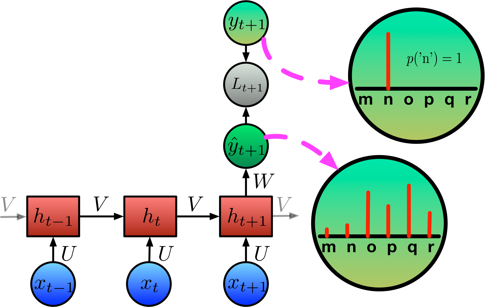
::::

:::: column
- Target: A probability distribution with $P(n) = 1$
- Output: A probability distribution over all next letters.
- E.g.: "My cat is named Simon" would lead to **X**: "My cat is named Simo" and **y**: "n"
::::

:::

---

## Using the trained model to generate text

::: columns

:::: column
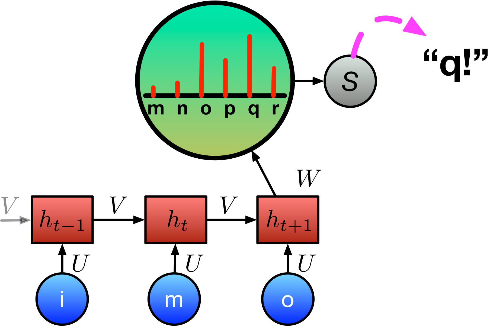
::::
 
:::: column
- **S**: Sampling function, sample a letter using the output probability distribution.
- The generated letter is reinserted at as the next input.
- We don't want to always draw the most likely character. The would give frequent repetition and "copying" from the training text. Need a sampling strategy.
::::

:::

---

## Char-RNN
 
::: columns

:::: column
- RNN as a sequence generator
- Input is current symbol, output is next predicted symbol.
- Connect output to input and continue!
- CharRNN simply applies this to a (subset) of ASCII characters.
- Train and generate on any text corpus: Fun!
::::

:::: column
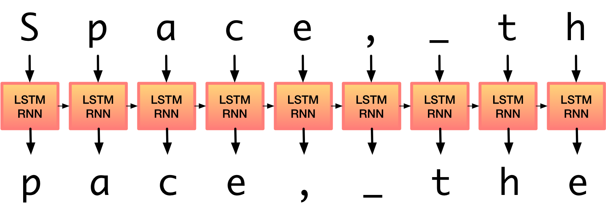

See: [Karpathy, A. (2015). The unreasonable effectiveness of recurrent neural networks.](http://karpathy.github.io/2015/05/21/rnn-effectiveness/)
::::

:::

---

## Char-RNN Examples

::: columns

:::: column
Shakespeare (Karpathy, 2015):

> 
> Second Senator:
> They are away this miseries, produced upon my soul,
> Breaking and strongly should be buried, when I perish
> The earth and thoughts of many states.

>
> DUKE VINCENTIO:
> Well, your wit is in the care of side and that.
> 

::::

:::: column
Latex Algebraic Geometry:

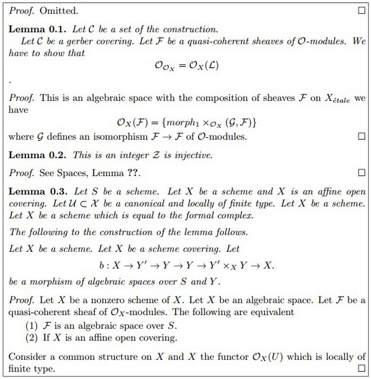

N.B. "_Proof._ Omitted." Lol.
::::

:::

---

## RNN Architectures and LSTM

---

## Bidirectional RNNs

::: columns

:::: column

::::

::::column
- Useful for tasks where the whole sequence is available.
- Each output unit ($\hat{y}$) depends on both past and future - but most sensitive to closer times.
- Popular in speech recognition, translation etc.
::::

:::

---

## Encoder-Decoder (seq-to-seq)

::: columns

:::: column

::::

:::: column
- Learns to generate output sequence (**y**) from an input sequence (**x**).
- Final hidden state of encoder is used to compute a context variable _C_.
- For example, translation.
::::

:::

---

## Deep RNNs

::: columns

:::: column

::::

:::: column
- Does adding deeper layers to an RNN make it work better?
- Several options for architecture.
- Simply stacking RNN layers is very popular; shown to work better by Graves et al. (2013)
- Intuitively: layers might learn some hierarchical knowledge automatically.
- Typical setup: up to three recurrent layers.
::::

:::

---

## Long-Term Dependencies

::: columns

:::: column
- Learning long dependencies is a mathematical challenge.
- Basically: gradients propagated through the same weights tend to vanish (mostly) or explode (rarely)
- E.g., consider a simplified RNN with no nonlinear activation function or input.
- Each time step multiplies _h(0)_ by _W_.
- This corresponds to raising power of eigenvalues in $\Lambda$.
- Eventually, components of _h(0)_ not aligned with the largest eigenvector will be discarded.
::::

:::: column
\begin{align*}
h_t &= Wh_{t-1}\\
h_t &= (W^t)h_0
\end{align*}

(supposing **W** admits eigendecomposition with orthogonal matrix **Q**)

\begin{align*}
W &= Q\Lambda Q^{\top}\\
h_t &= Q\Lambda ^t Qh_0
\end{align*}
::::

:::

---

## Vanishing and Exploding Gradients

::: columns

:::: column
- “in order to store memories in a way that is robust to small perturbations, the RNN must enter a region of parameter space where gradients vanish”
- “whenever the model is able to represent long term dependencies, the gradient of a long term interaction has exponentially smaller magnitude than the gradient of a short term interaction.” 
::::

:::: column
- Note that this problem is only relevant for recurrent networks since the weights **W** affecting the hidden state are the same at each time step.
- Goodfellow and Benigo (2016): “the problem of learning long-term dependencies remains one of the main challenges in deep learning”
- [WildML (2015). Backpropagation Through Time and Vanishing Gradients](http://www.wildml.com/2015/10/recurrent-neural-networks-tutorial-part-3-backpropagation-through-time-and-vanishing-gradients/)
- [ML for artists](https://ml4a.github.io/ml4a/RNNs/)
::::

:::

---

## Gated RNNs

::: columns

:::: column
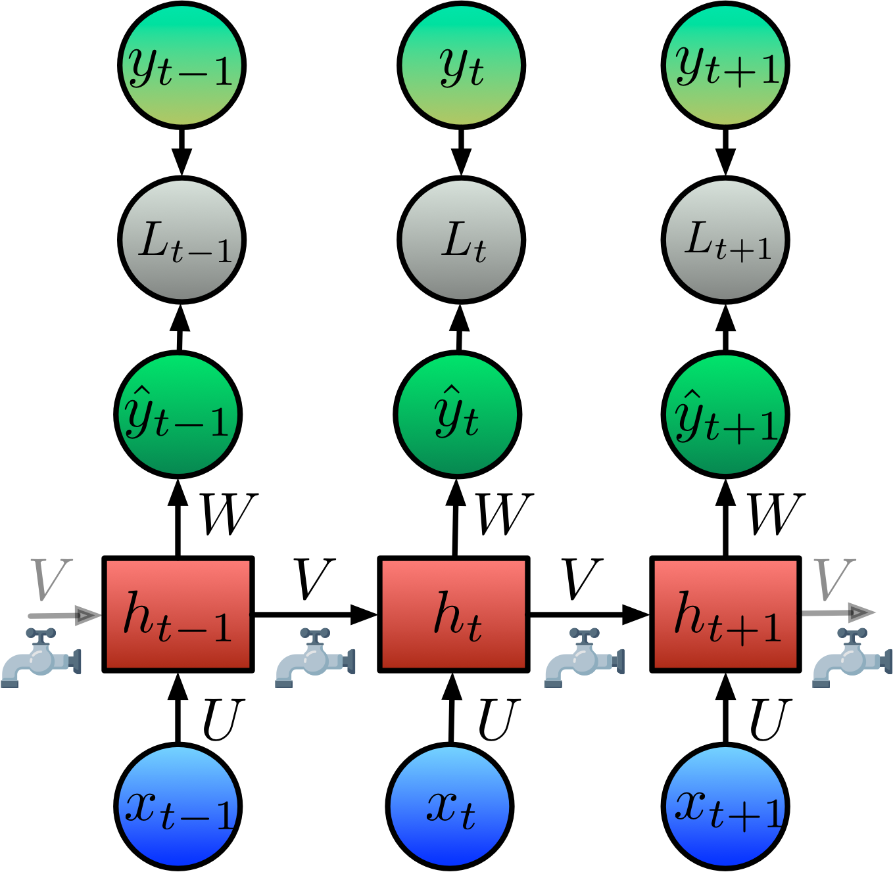
::::

:::: column
- Possible solution!
- Provide a gate that can change the hidden state a little bit at each step.
- The gates are controlled by **learnable weights** as well!
- Hidden state weights that may **change** at each time step.
- Create **paths through time** with derivatives that do not vanish/explode.
- Gates choose information to **accumulate** or **forget** at each time step.
- **Most effective sequence models used in practice!**
::::

:::

---

## Long Short-Term Memory

::: columns

:::: column
- Self-loop containing an internal state (c).
- Three extra gating units:
  - **Forget gate**: controls how much memory is preserved.
  - **Input gate**: control how much of current input is stored.
  - **Output gate**: control how much of state is shown to output.
- Each gate has own **weights** and **biases**, so this uses _lots_ more parameters.
- Some variants on this design, e.g., use c as additional input to three gate units.
::::

:::: column
{ width=80% }
::::

:::

---

## Long Short-Term Memory

::: columns

:::: column
- Forget gate: _f_
- Internal state: _s_
- Input gate: _g_
- Output gate: _q_
- Output: _h_
::::

:::: column
{ width=80% }
::::

:::

---

## Other Gating Units

::: columns

:::: column
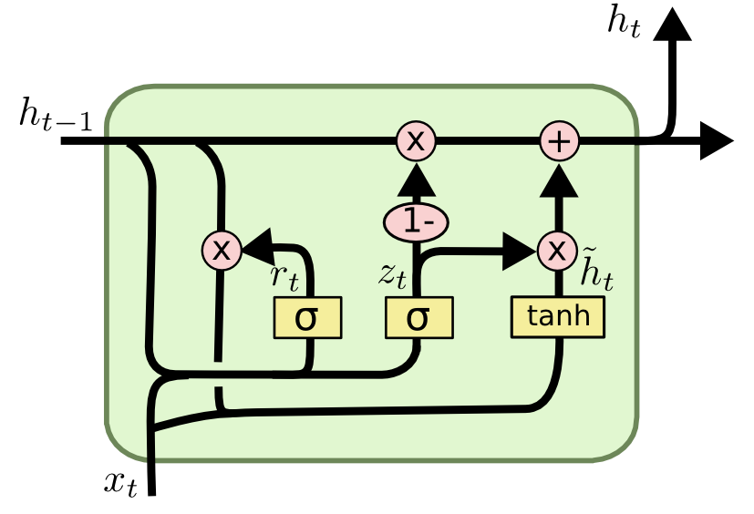{ width=100% }
Source: [(Olah, C. 2015.)](https://youtu.be/FpQCAd0zKiU)
::::

:::: column
- Are three gates necessary?
- Other gating units are simpler, e.g., Gated Recurrent Unit (GRU)
- For the moment, LSTMs are winning in practical use.
- Maybe someone wants to explore alternatives in a project?
::::

:::

---

## Visualising LSTM activations

Sometimes, the LSTM cell state corresponds with features of the sequential data:

{ width=80% }

Source: [(Karpathy, 2015)](http://karpathy.github.io/2015/05/21/rnn-effectiveness/)

---

## CharRNN Applications: FolkRNN

Some kinds of music can be represented in a text-like manner.

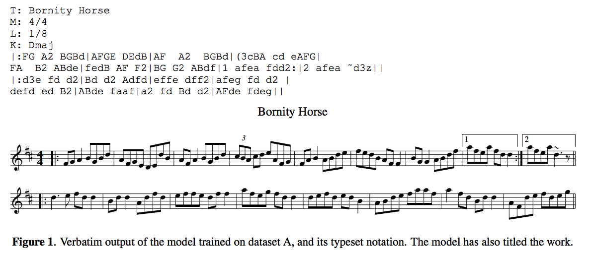{ width=80% }

Source: [Sturm et al. 2015. Folk Music Style Modelling by Recurrent Neural Networks with Long Short Term Memory Units](https://core.ac.uk/download/pdf/55873381.pdf)

---

## Other CharRNN Applications

::: columns

:::: column
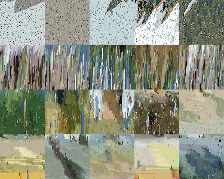
[Teaching Recurrent Neural Networks about Monet](http://blog.manugarri.com/teaching-recurrent-neural-networks-about-monet/)
::::

:::: column
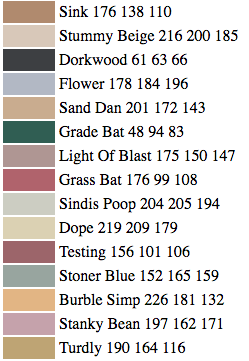
[New Paint Colours Invented by Neural Network](http://aiweirdness.com/post/160776374467/new-paint-colors-invented-by-neural-network)
::::

:::

---

## Google Magenta Performance RNN

::: columns

:::: column
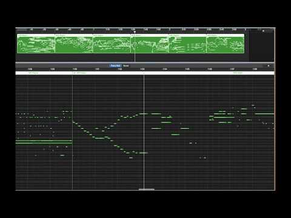
::::

:::: column

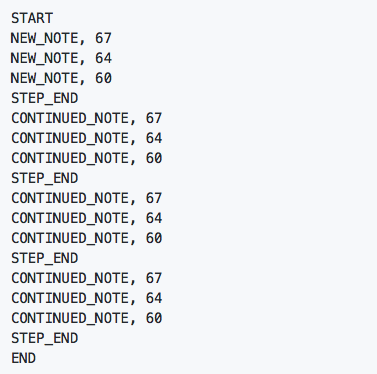
::::

:::

- State-of-the-art in music generating RNNs.
- Encode MIDI musical sequences as categorical data.
- Now supports polyphony (multiple notes), dynamics (volume), expressive timing (rubato).
- E.g.: https://youtu.be/JVf6esaXeLE

---

## Neural iPad Band, another CharRNN

::: columns

:::: column

::::

:::: column
- iPad music transcribed as sequence of numbers for each performer.
- Trick: encode multiple ints as one (preserving ordering).
- Video: https://youtu.be/FpQCAd0zKiU
::::

:::

---

## Books and Learning References

- Ian Goodfellow, Yoshua Bengio, and Aaron Courville. 2016. Deep Learning. MIT Press. http://www.deeplearningbook.org 
-  François Chollet. 2018. Manning. https://www.manning.com/books/deep-learning-with-python
- http://colah.github.io/posts/2015-08-Understanding-LSTMs/
- https://r2rt.com/recurrent-neural-networks-in-tensorflow-ii.html
- Maybe RNN/LSTM is dead? https://towardsdatascience.com/the-fall-of-rnn-lstm-2d1594c74ce0
- http://karpathy.github.io/2015/05/21/rnn-effectiveness/

---

## Summary

- Recurrent Neural Networks let us capture and model the structure of sequential data.
- Sampling from trained RNNs allow us to generate new, creative sequences.
- The internal state of RNNs make them interesting for interactive applications, since it lets them capture and continue from the current context or "style".
- LSTM units are able to overcome the vanishing gradient problem to some extent.

