<!-- theme: "white" -->

### So far; RNNs that Model Categorical Data

::: columns

:::: column
- Remember that most RNNs (and most deep learning models) end with a softmax layer.
- This layer outputs a probability distribution for a set of categorical predictions.
- E.g.:
    - image labels, 
    - letters, words, 
    - musical notes,
    - robot commands,
    - moves in chess.
::::

::::column
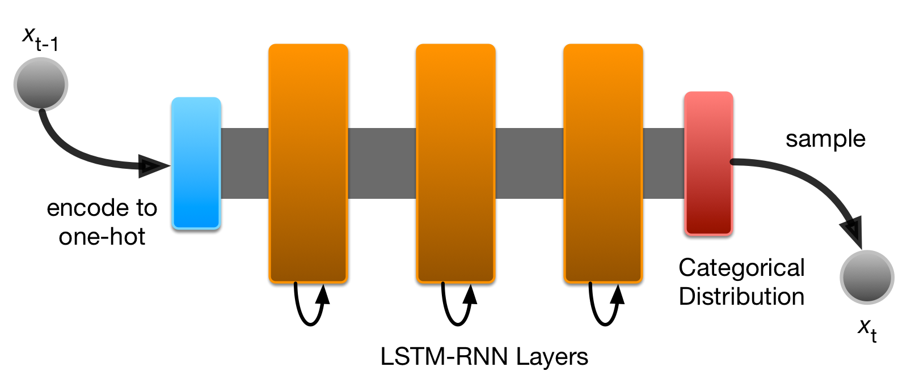{ width=95% }
{ width=80% }
::::

:::

---

### Expressive Data is Often Continuous

::: columns

:::: column
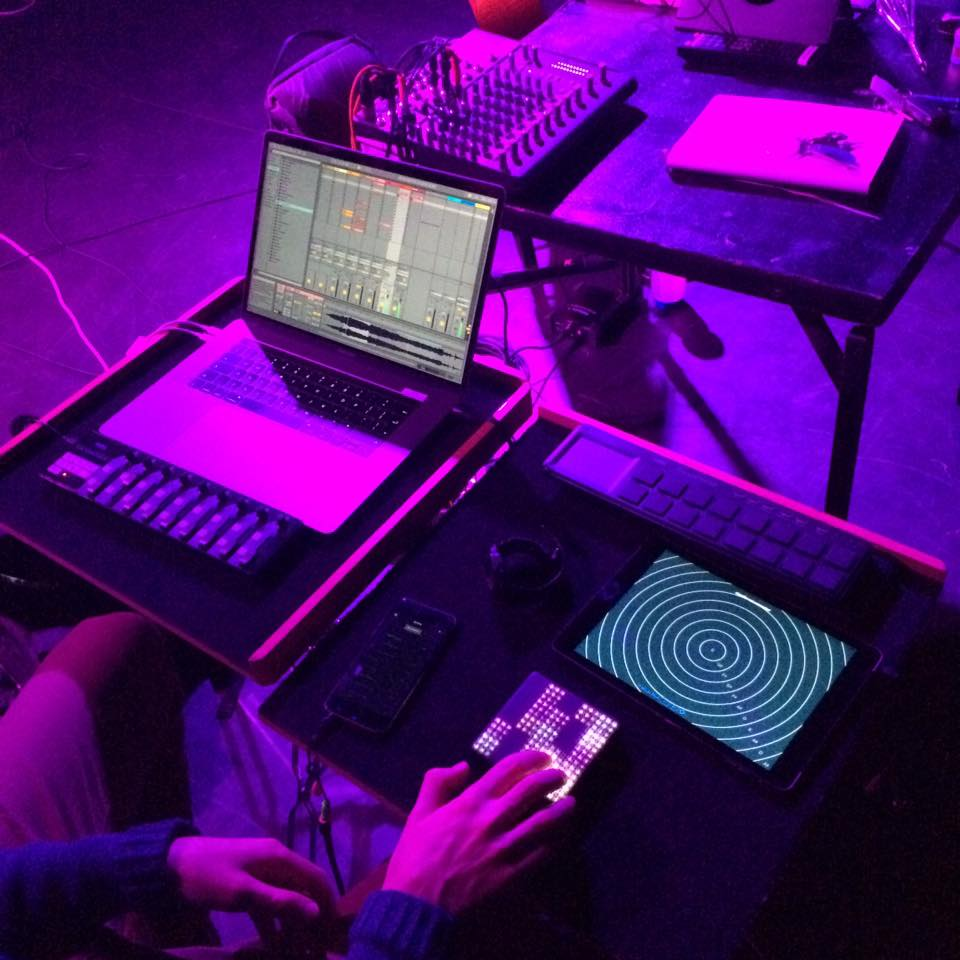{ width=60% }
{ width=60% }
::::

::::column
{ width=60% }
<iframe src="https://giphy.com/embed/1AjE1Ci6w3w6fv4D2z" width="80%" frameBorder="0" class="giphy-embed" allowFullScreen></iframe>
::::

:::

---

### So are Bio-Signals

::: columns

:::: column
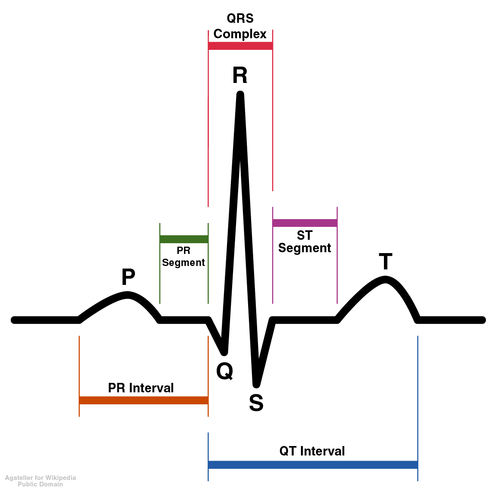{ width=60% }
::::

::::column
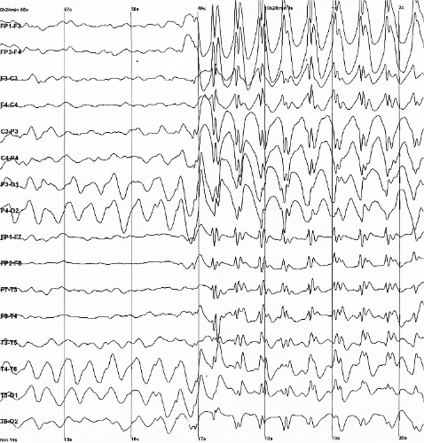{ width=60% }
{ width=60% }
::::

:::

Image Credit: Wikimedia

---

### Categorical vs. Continuous Models

::: columns

:::: column
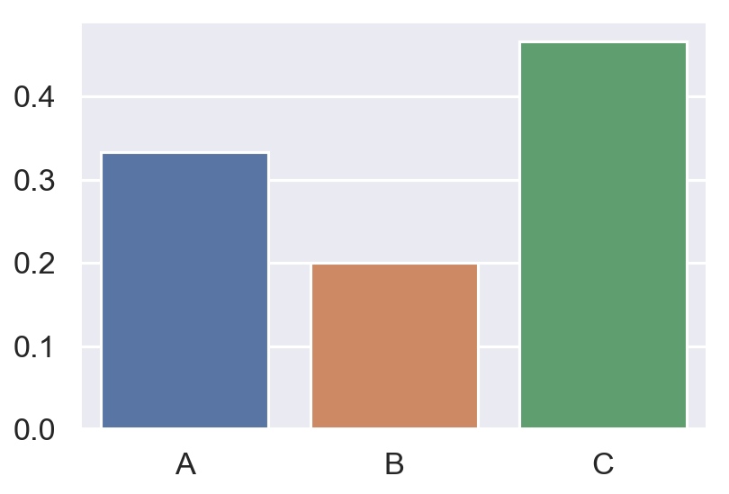
::::

::::column

::::

:::

---

### Normal (Gaussian) Distribution

::: columns

:::: column
- "Standard" probability distribution
- Has two parameters: 
    - mean ($\mu$) and 
    - standard deviation ($\sigma$)
- Probability Density Function:
    - $$\mathcal{N}(x \mid \mu, \sigma^2) = \frac{1}{\sqrt{2\pi\sigma^2} } e^{ -\frac{(x-\mu)^2}{2\sigma^2} }$$

::::

::::column
{ width=100% }

::::

:::

---

### Problem: Normal distribution might not fit data

::: columns

:::: column
What if the data is complicated?

- It's easy to "fit" a normal model to any data.
    - Just calculate $\mu$ and $\sigma$
- But this might not fit the data well.
::::

::::column
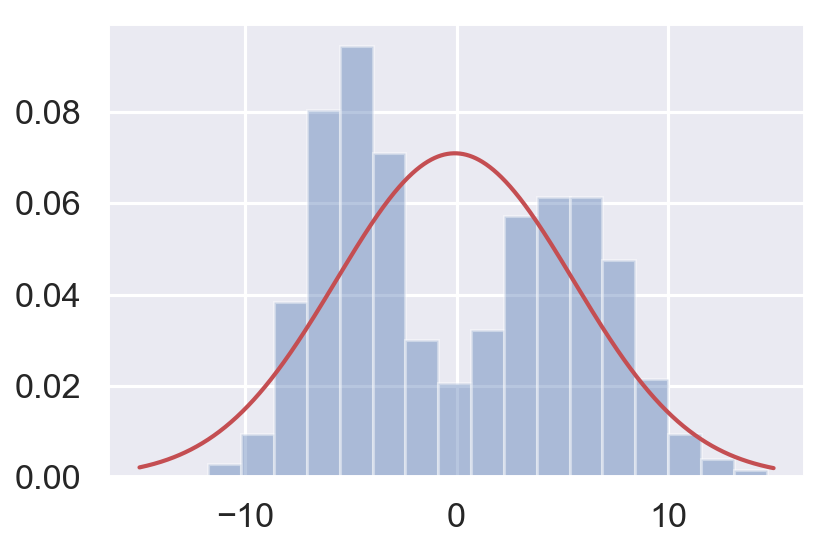{ width=100% }
::::

:::

---

### Mixture of Normals

::: columns

:::: column
Three groups of parameters:

- means ($\boldsymbol\mu$): location of each component
- standard deviations ($\boldsymbol\sigma$): width of each component
- Weight ($\boldsymbol\pi$): height of each curve
- Probability Density Function:
    - $$p(x) = \sum_{i=1}^K \pi_i\mathcal{N}(x \mid \mu, \sigma^2)$$

::::

::::column
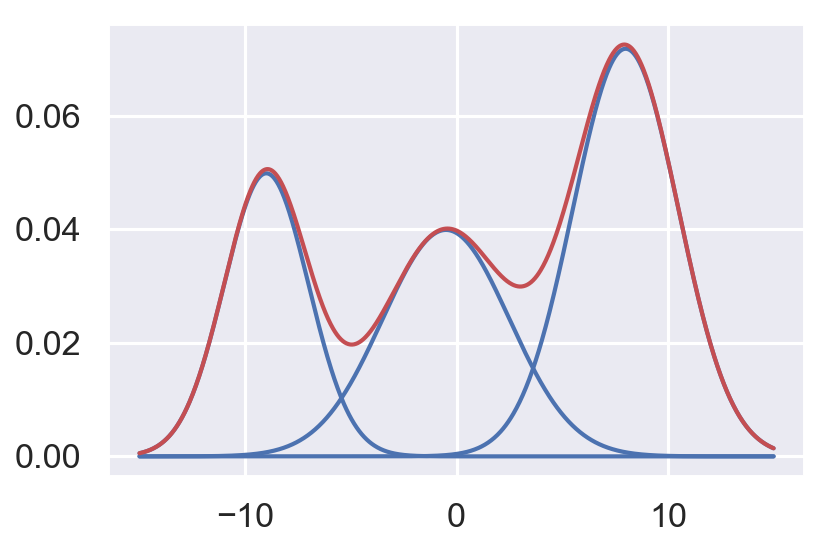{ width=100% }
::::

:::

---

### This solves our problem:

::: columns

:::: column
Returning to our modelling problem, let's plot the PDF of a evenly-weighted mixture of the two sample normal models.

We set:

- $K = 2$
- $\boldsymbol\pi = [0.5, 0.5]$
- $\boldsymbol\mu = [-5, 5]$
- $\boldsymbol\sigma = [2, 3]$
- (bold used to indicate the vector of parameters for each component)

In this case, I knew the right parameters, but normally you would have to _estimate_, or _learn_, these somehow...
::::

::::column
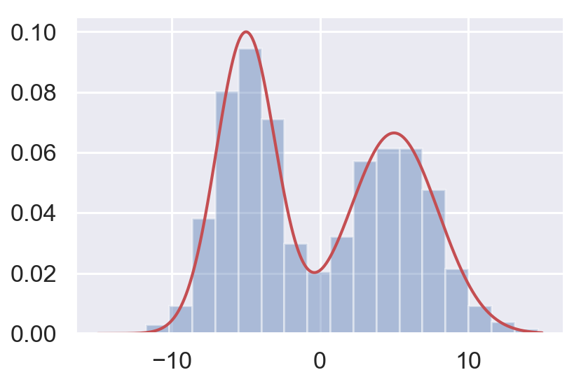{ width=100% }
::::

:::

---

## Mixture Density Networks

- Neural networks used to model complicated real-valued data.
    - i.e., data that might not be very "normal"
- Usual approach: use a neuron with linear activation to make predictions.
    - Training function could be MSE (mean squared error).
- Problem! This is equivalent to fitting to a single normal model! 😱
- (See Bishop, C (1994) for proof and more details)

---

## Mixture Density Networks

- Idea: output parameters of a mixture model instead!
- Rather than MSE for training, use the PDF of the mixture model.
- Now network can model complicated distributions! 😌

---

## Simple Example in Keras

{ width=30% }

- Difficult data is not hard to find! Think about modelling an inverse sine (arcsine) function.
    - Each input value takes multiple outputs...
    - This is not going to go well for a single normal model.

---

### Feedforward MSE Network

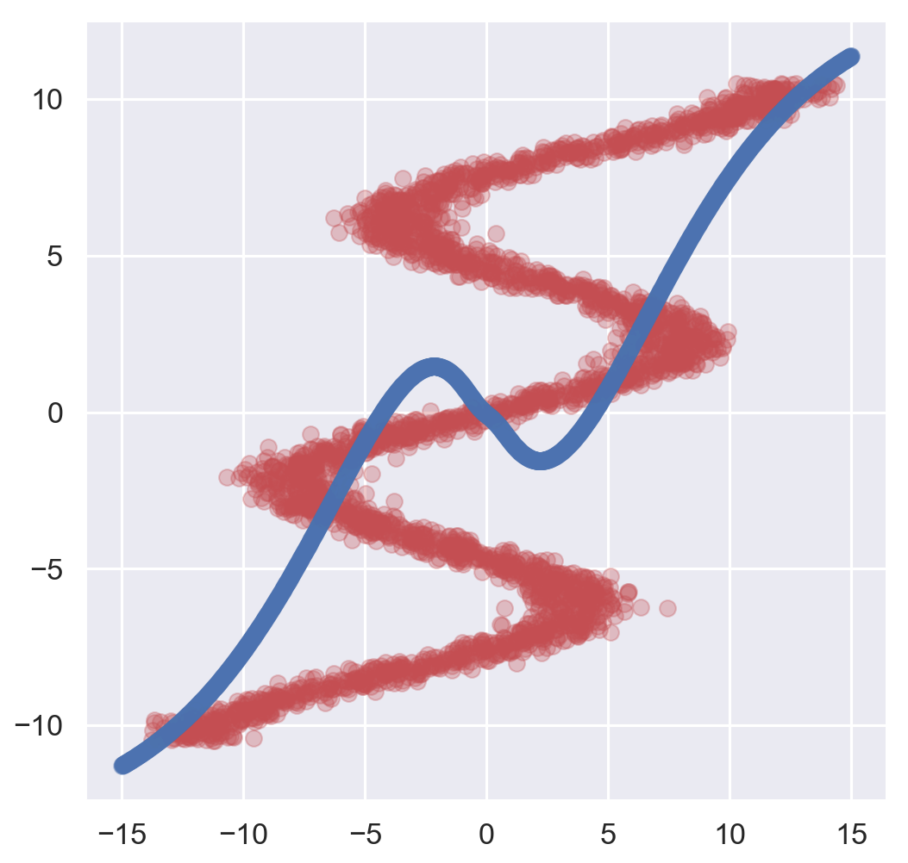{ width=30% }
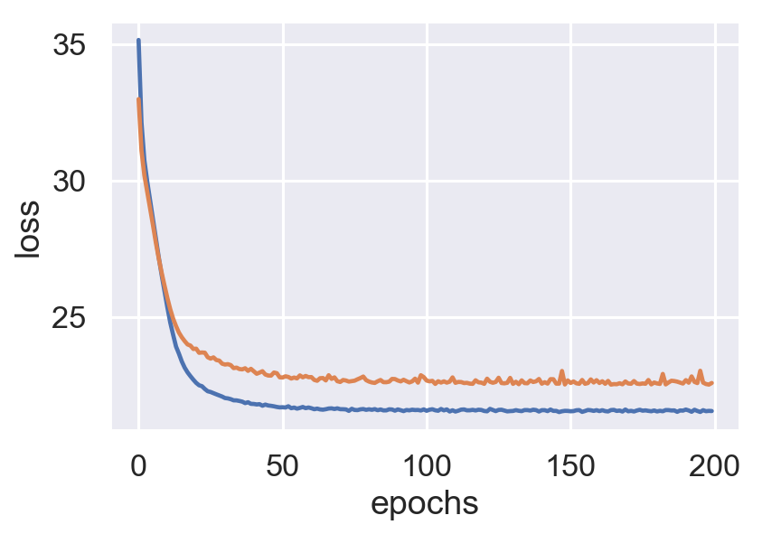{ width=40% }

Here's a simple two-hidden-layer network (286 parameters), trained to produce the above result.

~~~~~{.python .numberLines}
model = Sequential()
model.add(Dense(15, batch_input_shape=(None, 1), activation='tanh'))
model.add(Dense(15, activation='tanh'))
model.add(Dense(1, activation='linear'))
model.compile(loss='mse', optimizer='rmsprop')
model.fit(x=x_data, y=y_data, batch_size=128, epochs=200, validation_split=0.15)
~~~~~

---

## MDN Architecture:

- Loss function for MDN is negative log of likelihood function $\mathcal{L}$.
- $\mathcal{L}$ measures likelihood of $t$ being drawn from a mixture parametrised by $\mu$, $\sigma$, and $\pi$ which are generated by the network inputs $x$:

$$\mathcal{L} = \sum_{i=1}^K\pi_i(\mathbf{x})\mathcal{N}\bigl(\mu_i(\mathbf{x}), \sigma_i^2(\mathbf{x}); \mathbf{t} \bigr)$$

---

### Feedforward MDN Solution

{ width=30% }
{ width=40% }

And, here's a simple two-hidden-layer MDN (510 parameters), that achieves the above result! Much better!

~~~~~{.python .numberLines}
N_MIXES = 5

model = Sequential()
model.add(Dense(15, batch_input_shape=(None, 1), activation='relu'))
model.add(Dense(15, activation='relu'))
model.add(mdn.MDN(1, N_MIXES)) # here's the MDN layer!
model.compile(loss=mdn.get_mixture_loss_func(1,N_MIXES), optimizer='rmsprop')
model.summary()
~~~~~

---

### Getting inside the MDN layer

Here's the same network wihtout using the MDN layer abstraction (this is with Keras' functional API):

~~~~~{.python .numberLines}
def elu_plus_one_plus_epsilon(x):
    """ELU activation with a very small addition to help prevent NaN in loss."""
    return (K.elu(x) + 1 + 1e-8)

N_HIDDEN = 15
N_MIXES = 5

inputs = Input(shape=(1,), name='inputs')
hidden1 = Dense(N_HIDDEN, activation='relu', name='hidden1')(inputs)
hidden2 = Dense(N_HIDDEN, activation='relu', name='hidden2')(hidden1)

mdn_mus = Dense(N_MIXES, name='mdn_mus')(hidden2)
mdn_sigmas = Dense(N_MIXES, activation=elu_plus_one_plus_epsilon, name='mdn_sigmas')(hidden2)
mdn_pi = Dense(N_MIXES, name='mdn_pi')(hidden2)

mdn_out = Concatenate(name='mdn_outputs')([mdn_mus, mdn_sigmas, mdn_pi])

model = Model(inputs=inputs, outputs=mdn_out)
model.summary()
~~~~~

---

## Loss Function: The Tricky Bit.

Loss function for the MDN should be the negative log likelihood:

~~~~~{.python .numberLines}
def mdn_loss(y_true, y_pred):
    # Split the inputs into paramaters
    out_mu, out_sigma, out_pi = tf.split(y_pred, num_or_size_splits=[N_MIXES, N_MIXES, N_MIXES],
                                         axis=-1, name='mdn_coef_split')
    mus = tf.split(out_mu, num_or_size_splits=N_MIXES, axis=1)
    sigs = tf.split(out_sigma, num_or_size_splits=N_MIXES, axis=1)
    # Construct the mixture models
    cat = tfd.Categorical(logits=out_pi)
    coll = [tfd.MultivariateNormalDiag(loc=loc, scale_diag=scale) for loc, scale
            in zip(mus, sigs)]
    mixture = tfd.Mixture(cat=cat, components=coll)
    # Calculate the loss function
    loss = mixture.log_prob(y_true)
    loss = tf.negative(loss)
    loss = tf.reduce_mean(loss)
    return loss

model.compile(loss=mdn_loss, optimizer='rmsprop')
~~~~~

Let's go through bit by bit...

---

## Loss Function: Part 1:

First we have to extract the mixture paramaters.

~~~~~{.python .numberLines}
# Split the inputs into paramaters
out_mu, out_sigma, out_pi = tf.split(y_pred, num_or_size_splits=[N_MIXES, N_MIXES, N_MIXES],
                                     axis=-1, name='mdn_coef_split')
mus = tf.split(out_mu, num_or_size_splits=N_MIXES, axis=1)
sigs = tf.split(out_sigma, num_or_size_splits=N_MIXES, axis=1)
~~~~~

- Split up the parameters $\boldsymbol\mu$, $\boldsymbol\sigma$, and $\boldsymbol\pi$, remember that there are N_MIXES $= K$ of each of these.
- $\boldsymbol\mu$ and $\boldsymbol\sigma$ have to be split _again_ so that we can iterate over them (you can't iterate over an axis of a tensor...)

---

## Loss Function: Part 2:

Now we have to construct the mixture model's PDF. 

~~~~~{.python .numberLines}
# Construct the mixture models
cat = tfd.Categorical(logits=out_pi) 
coll = [tfd.Normal(loc=loc, scale=scale) for loc, scale
        in zip(mus, sigs)]
mixture = tfd.Mixture(cat=cat, components=coll)
~~~~~

- For this, we're using the `Mixture` abstraction provided in `tensorflow-probability.distributions`.
- This takes a categorical (a.k.a. softmax, a.k.a. generalized Bernoulli distribution) model, and a list the component distributions.
- Each normal PDF is contructed using `tfd.Normal`.
- Can do this from first principles as well, but good to use abstractions that are available (?)

---

## Loss Function: Part 3:

Finally, we calculate the loss:

~~~~~{.python .numberLines}
loss = mixture.log_prob(y_true)
loss = tf.negative(loss)
loss = tf.reduce_mean(loss)
~~~~~

- `mixture.log_prob(y_true)` means "the log-likelihood of sampling `y_true` from the distribution called `mixture`."

---

## Some more details....

{ width=40% }

- This "version" of a mixture model works for a mixture of 1D normal distributions.
- Not too hard to extend to multivariate normal distributions, which are useful for lots of problems.
- This is how it actually works in my Keras MDN layer, [have a look at the code for more details...](https://github.com/cpmpercussion/keras-mdn-layer/)

---

## MDN-RNNs

MDNs can be handy at the end of an RNN! Imagine a robot calculating moves forward through space, it might have to choose from a number of valid positions, each of which could be modelled by a 2D Normal model.

---

## MDN-RNN Architecture

Can be as simple as putting an MDN layer after recurrent layers!

---

## Use Cases: Handwriting Generation

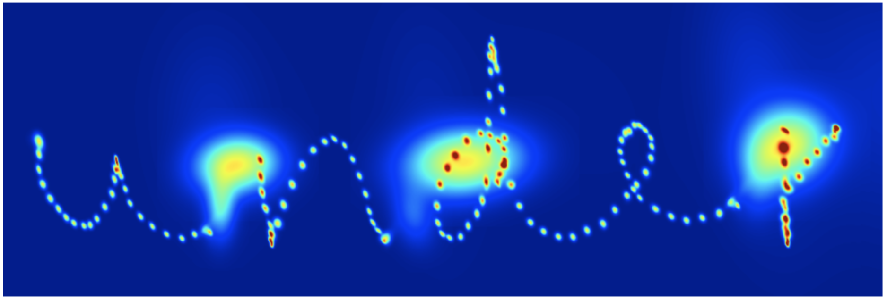{ width=40% }
{ width=40% }

- Handwriting Generation RNN (Graves, 2013).
- Trained on handwriting data.
- Predicts the next location of the pen ($dx$, $dy$, and up/down)
- Network takes text to write as an extra input, RNN learns to decide what character to write next.

---

## Use Cases: SketchRNN

{ width=40% }
{ width=40% }

- SketchRNN Kanji (Ha, 2015); similar to handwriting generation, trained on kanji and then generates new "fake" characters
- SketchRNN VAE (Ha et al., 2017); similar again, but trained on human-sourced sketches. VAE architecture with bidirectional RNN encoder and MDN in the decoder part.

---

## Use Cases: RoboJam

::: columns

:::: column
<iframe src="https://giphy.com/embed/l1Lc4C4TcCTI4Wi8o" width="270" height="480" frameBorder="0" class="giphy-embed" allowFullScreen></iframe>
::::

:::: column
- RoboJam (Martin et al., 2018); similar to the kanji RNN, but trained on touchscreen musical performances
- Extra complexity: have to model touch position ($x$, $y$) and time ($dt$).
- Implemented in my MicroJam app (have a go: [microjam.info](https://microjam.info))
::::

:::

---

### Use Cases: World Models

::: columns

:::: column
- [World Models](https://worldmodels.github.io) (Ha & Schmidhuber, 2018)
- Train a VAE for visual perception an environment (e.g., VizDoom), now each frame from the environment can be represented by a vector $z$
- Train MDN to predict next $z$, use this to help train an agent to operate in the environment.
::::

:::: column
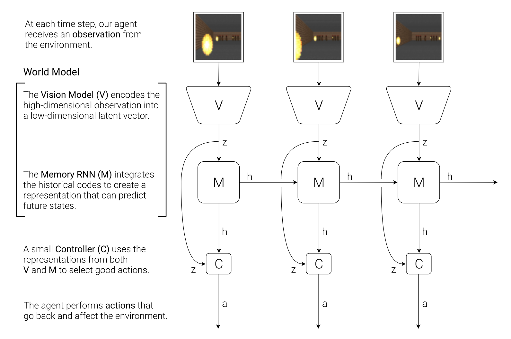{ width=80% }
{ width=80% }
::::

:::

---

## References

1. Christopher M. Bishop. 1994. Mixture Density Networks. [Technical Report NCRG/94/004](http://publications.aston.ac.uk/373/). Neural Computing Research Group, Aston University.
2. Axel Brando. 2017. Mixture Density Networks (MDN) for distribution and uncertainty estimation. Master’s thesis. Universitat Politècnica de Catalunya.
3. A. Graves. 2013. Generating Sequences With Recurrent Neural Networks. ArXiv e-prints (Aug. 2013). [ArXiv:1308.0850](https://arxiv.org/abs/1308.0850)
4. David Ha and Douglas Eck. 2017. A Neural Representation of Sketch Drawings. ArXiv e-prints (April 2017). [ArXiv:1704.03477](https://arxiv.org/abs/1704.03477)
5. Charles P. Martin and Jim Torresen. 2018. RoboJam: A Musical Mixture Density Network for Collaborative Touchscreen Interaction. In Evolutionary and Biologically Inspired Music, Sound, Art and Design: EvoMUSART ’18, A. Liapis et al. (Ed.). Lecture Notes in Computer Science, Vol. 10783. Springer International Publishing. DOI:[10.1007/9778-3-319-77583-8_11](http://dx.doi.org/10.1007/9778-3-319-77583-8_11)
6. D. Ha and J. Schmidhuber. 2018. Recurrent World Models Facilitate Policy Evolution. ArXiv e-prints (Sept. 2018). [ArXiv:1809.01999](https://arxiv.org/abs/1809.01999)
